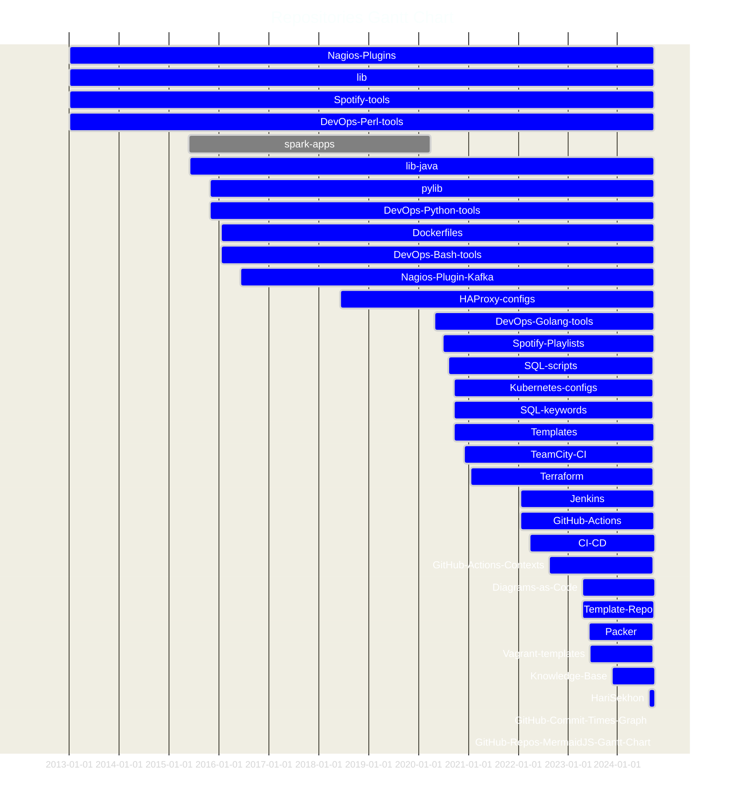

# Hari Sekhon - GitHub-Repos-MermaidJS-Gantt-Chart

[](https://github.com/HariSekhon/GitHub-Repos-MermaidJS-Gantt-Chart/stargazers)
[](https://github.com/HariSekhon/GitHub-Repos-MermaidJS-Gantt-Chart/network)
[](https://github.com/HariSekhon/GitHub-Repos-MermaidJS-Gantt-Chart#Hari-Sekhon---GitHub-Repos-MermaidJS-Gantt-Chart)
[](https://github.com/HariSekhon/GitHub-Repos-MermaidJS-Gantt-Chart/blob/master/LICENSE)
[](https://www.linkedin.com/in/HariSekhon/)
[](https://github.com/HariSekhon/GitHub-Repos-MermaidJS-Gantt-Chart/commits/master)

[](https://app.codacy.com/gh/HariSekhon/GitHub-Repos-MermaidJS-Gantt-Chart/dashboard?utm_source=gh&utm_medium=referral&utm_content=&utm_campaign=Badge_grade)
[](https://www.codefactor.io/repository/github/harisekhon/GitHub-Repos-MermaidJS-Gantt-Chart)
[](https://sonarcloud.io/dashboard?id=HariSekhon_GitHub-Repos-MermaidJS-Gantt-Chart)
[](https://sonarcloud.io/dashboard?id=HariSekhon_GitHub-Repos-MermaidJS-Gantt-Chart)
[](https://sonarcloud.io/dashboard?id=HariSekhon_GitHub-Repos-MermaidJS-Gantt-Chart)
[](https://sonarcloud.io/dashboard?id=HariSekhon_GitHub-Repos-MermaidJS-Gantt-Chart)


[](https://github.com/HariSekhon/DevOps-Bash-tools#hari-sekhon---devops-bash-tools)
[](https://github.com/HariSekhon/DevOps-Bash-tools#hari-sekhon---devops-bash-tools)

[](https://brew.sh/)
[](https://alpinelinux.org/)
[](https://www.centos.org/)
[](https://www.debian.org/)
[](https://getfedora.org/)
[](https://www.redhat.com/en)
[](https://rockylinux.org/)
[](https://ubuntu.com/)

<!-- TODO: Replace Azure DevOps Pipeline ID here -->
[](https://harisekhon.github.io/CI-CD/)
[](https://dev.azure.com/harisekhon/GitHub/_build/latest?definitionId=15&branchName=master)
[](https://gitlab.com/HariSekhon/GitHub-Repos-MermaidJS-Gantt-Chart/pipelines)
[](https://bitbucket.org/HariSekhon/GitHub-Repos-MermaidJS-Gantt-Chart/addon/pipelines/home#!/)

[](https://github.com/HariSekhon/GitHub-Repos-MermaidJS-Gantt-Chart)
[](https://gitlab.com/HariSekhon/GitHub-Repos-MermaidJS-Gantt-Chart)
[](https://dev.azure.com/HariSekhon/GitHub/_git/GitHub-Repos-MermaidJS-Gantt-Chart)
[](https://bitbucket.org/HariSekhon/GitHub-Repos-MermaidJS-Gantt-Chart)

[](https://github.com/HariSekhon/GitHub-Repos-MermaidJS-Gantt-Chart/actions/workflows/validate.yaml)
[](https://github.com/HariSekhon/GitHub-Repos-MermaidJS-Gantt-Chart/actions/workflows/kics.yaml)
[](https://github.com/HariSekhon/GitHub-Repos-MermaidJS-Gantt-Chart/actions/workflows/grype.yaml)
[](https://github.com/HariSekhon/GitHub-Repos-MermaidJS-Gantt-Chart/actions/workflows/semgrep.yaml)
[](https://github.com/HariSekhon/GitHub-Repos-MermaidJS-Gantt-Chart/actions/workflows/semgrep-cloud.yaml)
[](https://github.com/HariSekhon/GitHub-Repos-MermaidJS-Gantt-Chart/actions/workflows/sonarcloud.yaml)
[](https://github.com/HariSekhon/GitHub-Repos-MermaidJS-Gantt-Chart/actions/workflows/trivy.yaml)

Generates a [MermaidJS](https://mermaid.js.org/) Gantt chart of a GitHub user's public repos active dates
using each repo's created and pushed dates.

<!-- INDEX_START -->

- [Run](#run)
- [Build Binary](#build-binary)
- [Results](#results)
- [MermaidJS Gantt Config](#mermaidjs-gantt-config)
- [Caveats](#caveats)
  - [Trivial Commits](#trivial-commits)
  - [GitHub Repo Creation Date vs Initial Git Commit Date](#github-repo-creation-date-vs-initial-git-commit-date)
  - [Last Push Date vs Last Commit Date](#last-push-date-vs-last-commit-date)
  - [Use as a QuickStart](#use-as-a-quickstart)
- [More Core Repos](#more-core-repos)
  - [Knowledge](#knowledge)
  - [DevOps Code](#devops-code)
  - [Containerization](#containerization)
  - [CI/CD](#cicd)
  - [DBA - SQL](#dba---sql)
  - [DevOps Reloaded](#devops-reloaded)
  - [Templates](#templates)
  - [Misc](#misc)

<!-- INDEX_END -->

## Run

```shell
go run main.go <username>
```

Generates [MermaidJS](https://mermaid.js.org/) file:

```none
gantt_chart.mmd
```

## Build Binary

You can also build a portable binary by just running the Makefile:

```shell
make
```

Generates a binary `github-repos-gantt`.

Use this binary

```shell
./github-repos-gantt <username>
```

## Results

Generates a [gant_chart.mmd](gantt_chart.mmd) with contents like this:

<!-- GANTT_CHART_START -->

```none
%%{ init: {
        "logLevel": "debug",
        'theme': 'dark',
        'themeVariables': {
          'activeTaskBkgColor': '#0000ff',
          'activeTaskBorderColor': 'lightgrey',
          'critBorderColor': 'lightgrey',
          'doneTaskBkgColor': 'grey',
          'doneTaskBorderColor': 'lightgrey',
          'taskBkgColor': 'black',
          'taskBorderColor': 'black',
          'taskTextColor': 'white',
          'taskTextDarkColor': 'white',
          'taskTextLightColor': 'black',
          'todayLineColor': 'red'
        }
    }
}%%
gantt
    dateFormat  YYYY-MM-DD
    title Repositories Gantt Chart
    Nagios-Plugins : active, 2012-12-30, 2024-09-22
    lib : active, 2012-12-30, 2024-09-22
    Spotify-tools : active, 2012-12-30, 2024-09-22
    DevOps-Perl-tools : active, 2012-12-30, 2024-09-22
    spark-apps : done, 2015-05-25, 2020-04-02
    lib-java : active, 2015-05-31, 2024-09-22
    pylib : active, 2015-10-27, 2024-09-23
    DevOps-Python-tools : active, 2015-10-27, 2024-09-23
    Dockerfiles : active, 2016-01-17, 2024-09-28
    DevOps-Bash-tools : active, 2016-01-17, 2024-09-28
    Nagios-Plugin-Kafka : active, 2016-06-07, 2024-09-22
    HAProxy-configs : active, 2018-06-08, 2024-09-22
    DevOps-Golang-tools : active, 2020-04-30, 2024-09-22
    Spotify-Playlists : active, 2020-06-29, 2024-09-22
    SQL-scripts : active, 2020-08-05, 2024-09-21
    Kubernetes-configs : active, 2020-09-16, 2024-09-21
    SQL-keywords : active, 2020-09-16, 2024-09-21
    Templates : active, 2020-09-16, 2024-09-25
    TeamCity-CI : active, 2020-12-03, 2024-09-21
    Terraform : active, 2021-01-18, 2024-09-21
    Jenkins : active, 2022-01-17, 2024-09-23
    GitHub-Actions : active, 2022-01-17, 2024-09-22
    CI-CD : active, 2022-03-25, 2024-10-01
    GitHub-Actions-Contexts : active, 2022-08-17, 2024-09-21
    Diagrams-as-Code : active, 2023-04-14, 2024-10-02
    Template-Repo : active, 2023-04-15, 2024-09-22
    Packer : active, 2023-06-02, 2024-09-21
    Vagrant-templates : active, 2023-06-12, 2024-09-21
    Knowledge-Base : active, 2023-11-22, 2024-09-29
    HariSekhon : active, 2024-08-14, 2024-10-02
    GitHub-Commit-Times-Graph : active, 2024-09-07, 2024-09-08
    GitHub-Repos-MermaidJS-Gantt-Chart : active, 2024-10-02, 2024-10-02
```

<!-- GANTT_CHART_END -->

That can be embedded into a GitHub markdown file such as a `README.md` or run in MermaidJS to visualize like this:

<!-- GANTT_CHART2_START -->



<!-- GANTT_CHART2_END -->

## MermaidJS Gantt Config

The [init.mmd](https://raw.githubusercontent.com/HariSekhon/GitHub-Repos-MermaidJS-Gantt-Chart/refs/heads/main/init.mmd)
file contains the settings that are read into the generated `gantt_chart.mmd` file.

```none
init.mmd
```

## Caveats

### Trivial Commits

If you've made trivial commits and pushes to update a repo's `README.md` or submodule updates
but not really added any substance to the code of the project, then it will appear to be a current project by the last
push date.

In such cases you may prefer to alter the end date to when you know you stopped actively working
on the project (look at the `git log` or `git log -p`) to give a more realistic ending timeline.

One solution is to generate graphs of commits per month and year to see visually where the substantial activity dropped
off.

If there was recent substantial activity of `README.md` and submodule updates making the drop off in activity not
obvious then you can filter the git log commit count to only look at code paths.

`git_graph_commit_history.sh` can do both of these instantly and can be found in the epic
[DevOps-Bash-tools](https://github.com/HariSekhon/DevOps-Bash-tools) repo.

### GitHub Repo Creation Date vs Initial Git Commit Date

If you've pushed an existing Git repo into a new GitHub repo the start date of the gantt chart will be too new as it's
the creation date of the GitHub repo as returned by the GitHub API instead of the initial Git commit.

In most cases these are the same.
Only in cases of pre-existing Git repos being pushed into new GitHub repos should you
need to adjust the start date to be that of your initial Git commit date for better accuracy.

This scenario may arise when migrating a pre-existing Git repo to GitHub, or forking a subdirectory of an existing repo
to a new repo to use as a shared submodule.

### Last Push Date vs Last Commit Date

This program uses GitHub API's last git push date, which may not be the same as the last git commit date,
but usually these are close enough together that it doesn't matter.

This is still really the last activity date of the repo and generally fine to use.

On the Gantt chart minor differences in dates are not perceptible anyway.

### Use as a QuickStart

Regardless of the above caveats, this is still a great and fast starting point to create the Gannt chart as it automates
the vast majority of creating this MermaidJS [Diagram-as-Code](https://github.com/HariSekhon/Diagrams-as-Code).

## More Core Repos

<!-- OTHER_REPOS_START -->

### Knowledge

[](https://github.com/HariSekhon/Knowledge-Base)
[](https://github.com/HariSekhon/Diagrams-as-Code)

<!--

Not support on GitHub Markdown:

<iframe src="https://raw.githubusercontent.com/HariSekhon/HariSekhon/main/knowledge.md" width="100%" height="500px"></iframe>

Does nothing:

<embed src="https://raw.githubusercontent.com/HariSekhon/HariSekhon/main/knowledge.md" width="100%" height="500px" />

-->

### DevOps Code

[](https://github.com/HariSekhon/DevOps-Bash-tools)
[](https://github.com/HariSekhon/DevOps-Python-tools)
[](https://github.com/HariSekhon/DevOps-Perl-tools)
[](https://github.com/HariSekhon/DevOps-Golang-tools)

<!--
[](https://gist.github.com/HariSekhon/f8f551332440f1ca8897ff010e363e03)
-->

### Containerization

[](https://github.com/HariSekhon/Kubernetes-configs)
[](https://github.com/HariSekhon/Dockerfiles)

### CI/CD

[](https://github.com/HariSekhon/GitHub-Actions)
[](https://github.com/HariSekhon/Jenkins)

### DBA - SQL

[](https://github.com/HariSekhon/SQL-scripts)

### DevOps Reloaded

[](https://github.com/HariSekhon/Nagios-Plugins)
[](https://github.com/HariSekhon/HAProxy-configs)
[](https://github.com/HariSekhon/Terraform)
[](https://github.com/HariSekhon/Packer-templates)
[](https://github.com/HariSekhon/Nagios-Plugin-Kafka)

### Templates

[](https://github.com/HariSekhon/Templates)
[](https://github.com/HariSekhon/GitHub-Repos-MermaidJS-Gantt-Chart)

### Misc

[](https://github.com/HariSekhon/Spotify-tools)
[](https://github.com/HariSekhon/Spotify-playlists)

The rest of my original source repos are
[here](https://github.com/HariSekhon?tab=repositories&q=&type=source&language=&sort=stargazers).

Pre-built Docker images are available on my [DockerHub](https://hub.docker.com/u/harisekhon/).

<!-- 1x1 pixel counter to record hits -->


<!-- OTHER_REPOS_END -->
